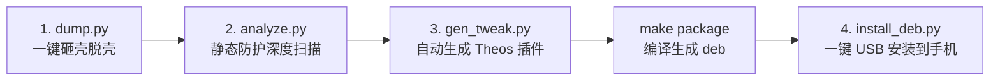

# iOS 逆向与安全防护分析全流程工具链 (iOS Reverse & Security Suite)

> 一站式解决 iOS 应用 **脱壳解密** ➔ **静态安全防护审计** ➔ **Bypass 插件自动化生成** ➔ **USB 极速部署生效** 的完整闭环工具链。



---

## 🌟 核心功能特性

1. **一键内存脱壳 (Decryption)**：基于 Frida USB 高速通信，支持 iOS 15+ / 16+ / 17+ 现代内核，自动拉取主程序、Frameworks 动态库及 Extensions 扩展并复位 `cryptid` 为 0。
2. **全方位静态防护扫描 (Security Analysis)**：深度递归扫描 IPA，精准定位 **反调试 (Anti-Debug)**、**越狱检测 (Jailbreak)**、**HTTPS 证书固定 (SSL Pinning)**、**Frida/Hook 探针** 及 **编译加固配置**。
3. **Theos 插件自动化生成 (Tweak Generator)**：根据静态扫描命中的具体检测点，**智能按需组装** Logos / C Hook 源码，一键生成标准 Theos 工程，并附赠 Frida 免编译动态脚本。
4. **USB 一键自动化安装 (Auto Installer)**：通过 USB 直连（`iproxy` 转发）极速传输 `.deb` 安装包，自动适配 Rootless / Rootful 权限提权并重启目标应用。

---

## 🛠 环境准备

### 1. iPhone 越狱设备端
- 设备已越狱（支持 Dopamine、Palera1n、Xina、unc0ver、checkra1n 等）；
- 越狱商店安装 **Frida**（推荐 16.x / 17.x）与 **OpenSSH**。

### 2. 电脑端 (macOS)
- 安装 Python 3.10+ 及依赖：
  ```bash
  pip3 install -r requirements.txt
  ```
- 建立 USB 端口转发（保持终端运行）：
  ```bash
  iproxy 2222 22
  ```
- （可选）在当前目录下配置 `手机连接信息.txt`，工具将自动免交互读取：
  ```ini
  User = 'root'
  Password = '你的SSH密码'
  Host = '127.0.0.1'
  Port = 2222
  ```

---

## 🚀 四步完整工作流指南

### 步骤一：一键砸壳脱壳 (`dump.py`)

保持手机屏幕解锁且目标 App 处于打开状态，通过 App 显示名称或 Bundle ID 直接拉取脱壳 IPA：

```bash
# 砸壳 WhatsApp
python3 dump.py WhatsApp

# 砸壳 Messenger 并指定输出文件
python3 dump.py -o Messenger_decrypted.ipa com.facebook.Messenger
```

---

### 步骤二：静态防护深度扫描 (`analyze.py`)

对生成的未加密 IPA 或已有包进行全量静态特征审计，快速输出终端彩色报表、交互式 HTML 或 Markdown 报告：

```bash
# 1. 基础控制台彩色高亮分析
python3 analyze.py -f Messenger.ipa

# 2. 导出现代化独立 HTML 交互式报告
python3 analyze.py -f Messenger.ipa -o report_messenger.html

# 3. 导出 Markdown 格式审计报告
python3 analyze.py -f Messenger.ipa -o report.md --format markdown

# 4. 输出结构化 JSON 数据 (供 CI/CD 流水线调用)
python3 analyze.py -f Messenger.ipa --json
```

#### 覆盖的检测维度：
- **反调试 (Anti-Debug)**: `ptrace (PT_DENY_ATTACH)`, `sysctl (P_TRACED/kinfo_proc)`, `task_get_exception_ports`, `SIGTRAP`, `getppid`, `isatty`, `DYLD_INSERT_LIBRARIES`
- **越狱检测 (Jailbreak)**: `/var/jb/` 等 Rootful/Rootless 越狱路径, `cydia://` 等 URL Scheme 探测, 沙盒逃逸写测试, `_dyld_get_image_name` 镜像遍历, `system/popen/fork`
- **SSL Pinning**: `TrustKit`, `AFSecurityPolicy`, `Alamofire`, `SecTrustEvaluateWithError` 底层校验, `URLSession:didReceiveChallenge:`, 内置证书扫描
- **Frida & Hook 检测**: Frida 默认端口 (`27042/27043/23924/23946`), `FridaGadget/Agent` 模块, `gum-js-loop` 线程, `Fishhook/Dobby/Substrate` 框架
- **编译保护**: PIE, Stack Canary, ARC, FairPlay 加密状态 (Cryptid), ATS 明文配置

---

### 步骤三：自动生成 Theos 插件工程 (`gen_tweak.py`)

根据上一步扫描出的防护特征，自动生成定制化的 Theos Tweak 越狱插件源码及 Frida 脚本：

```bash
# 1. 针对目标 IPA 自动生成定制 Tweak 工程 (默认输出至 ./<AppName>Bypass)
python3 gen_tweak.py -f Messenger.ipa

# 2. 指定输出目录与自定义插件名称
python3 gen_tweak.py -f Messenger.ipa -o ./MessengerBypass --name MessengerSpecialBypass

# 3. 强制生成全量规则超级插件 (包含所有已知反调试、越狱、SSL固定、Frida检测规则)
python3 gen_tweak.py -f Messenger.ipa --all

# 4. 生成传统 Rootful 架构配置 (默认为 iOS 15+ Rootless)
python3 gen_tweak.py -f Messenger.ipa --rootful
```

#### 生成工程结构：
```
MessengerBypass/
├── Makefile            # 支持 iOS 14-17 Rootless/Rootful 自动探测 THEOS 路径
├── control             # 自动配置 Package 标识与 ellekit / mobilesubstrate 依赖
├── MessengerBypass.plist # 自动将 Filter.Bundles 绑定为目标 App 的 Bundle ID
├── Tweak.x             # 核心 Logos / C 函数 Hook 拦截源码 (带详细中文注释)
├── bypass.js           # 附赠 Frida 双模动态脚本 (免 Theos 编译，即时挂钩调试)
└── README.md           # 编译与使用指引
```

#### 编译打包 deb：
```bash
cd MessengerBypass
make package FINALPACKAGE=1
```

---

### 步骤四：一键 USB 部署到 iPhone (`install_deb.py`)

将编译生成的 deb 插件一键传输并安装到 iPhone，并自动重载目标应用：

```bash
# 1. 直接指定 Theos 工程目录 (自动选取 packages/ 下最新的 deb 安装并重启 App)
python3 install_deb.py ./MessengerBypass -k Messenger

# 2. 直接指定单文件 .deb 安装
python3 install_deb.py ./MessengerBypass/packages/com.securityresearcher.messengerbypass_1.0.0_iphoneos-arm64.deb

# 3. 安装后自动注销桌面 (Respring)
python3 install_deb.py ./MessengerBypass --respring

# 4. 指定自定义端口与密码
python3 install_deb.py ./MessengerBypass -p 2222 --password 你的密码 -k Messenger
```

---

## ⚡ 极速免编译调试方案 (Frida 双模)

若当前电脑未配置 Theos 编译环境，可直接使用步骤三附赠的 `bypass.js`，无需安装 deb，通过 USB 一键免密动态挂钩：

```bash
# 启动并注入 Messenger (自动绕过所有反调试、越狱、SSL Pinning 与 Frida 检测)
frida -U -f com.facebook.Messenger -l ./MessengerBypass/bypass.js

# 或附加到已在手机前台打开的 App
frida -U -n "Messenger" -l ./MessengerBypass/bypass.js
```

---

## 📂 项目模块全景

```
frida-ios-dump/
├── dump.py                     # [步骤 1] iOS 一键砸壳脱壳工具
├── dump.js                     # Frida 内存脱壳与二进制修补脚本
├── analyze.py                  # [步骤 2] IPA 静态安全防护检测工具
├── gen_tweak.py                # [步骤 3] Theos Tweak 插件自动化生成工具
├── install_deb.py              # [步骤 4] iPhone DEB 自动化安装与重载工具
├── analyzer/                   # 核心分析与扫描引擎库
│   ├── ipa_parser.py           # IPA 解包与资源解析
│   ├── macho_parser.py         # Mach-O 二进制结构/符号提取
│   ├── engine.py               # 规则匹配与安全评分引擎
│   ├── reporter.py             # 终端彩色/HTML/Markdown/JSON 报告器
│   ├── tweak_generator.py      # Tweak 源码与 Frida 脚本组装器
│   └── rules/                  # 各类检测规则定义库 (Anti-Debug, Jailbreak, SSL, Frida, Config)
├── 手机连接信息.txt             # 本地 USB / SSH 连接配置
└── requirements.txt            # Python 运行依赖
```

---

## 成功验证案例 (Verified Cases)

| 目标应用 | Bundle ID | 验证流程 | 结果 |
| :--- | :--- | :--- | :--- |
| **Messenger** | `com.facebook.Messenger` | 砸壳 ➔ 静态审计 ➔ 生成 Tweak ➔ USB 安装部署 | ✅ 全流程闭环验证通过，防护成功绕过 |
| **WhatsApp** | `net.whatsapp.WhatsApp` | 砸壳 ➔ 静态审计 ➔ 生成 Tweak ➔ USB 安装部署 | ✅ 检出 17 项复合防护，deb 部署通过 |
| **Telegram** | `org.telegram.Telegram` | 砸壳 ➔ 静态审计 ➔ 生成 Tweak | ✅ 大体积 IPA 深度递归分析与生成通过 |
| **InspectorVpn** | `com.github.zhkl0228.inspector.vpn` | 静态审计 ➔ 生成 Tweak | ✅ 针对性拦截 Dyld 镜像遍历与端口探测 |

---

Happy Hacking!
